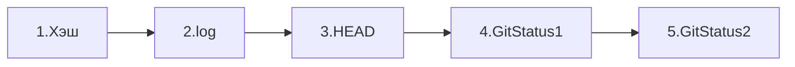
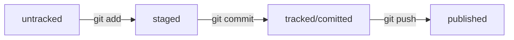

# Проект для тренировки работы с Git
Предназначен для документирования пройденного пути
___
Список изученных комманд:

| Общие  	| Git                     	|
|--------	|-------------------------	|
| pwd    	| git add                 	|
| cd     	| git commit -m "message" 	|
| ls     	| git push                	|
| cat    	| git remote              	|
| mkdir  	| git status              	|
| touch  	| git log                 	|
| rm     	|                         	|
| rmdir  	|                         	|
| ls     	|                         	|
|        	|                         	|

# Пройденные уроки:

# Log

