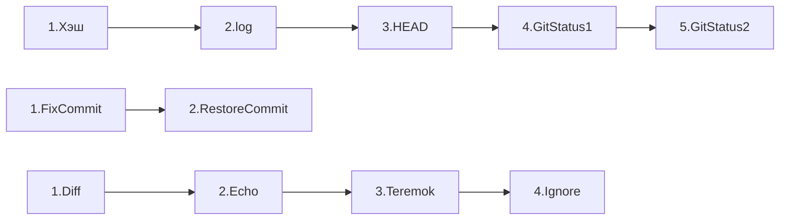

# Проект для тренировки работы с Git
Предназначен для документирования пройденного пути
___
Список изученных комманд:

| Общие  	| Git                     	     |
|--------	|------------------------------- |
| pwd    	| git add                 	     |
| cd     	| git commit -m "message" 	     |
| ls     	| git push                	     |
| cat    	| git remote              	     |
| mkdir  	| git status              	     |
| touch  	| git log                 	     |
| rm     	| git add --amend                |
| rmdir  	| git restore --staged  file     |
| ls     	| git reset --hard commit hash   |
| echo    | git diff                       |
|        	| git diff --staged              |
|        	| git clone                      |
|        	| git fork                       |
|        	| git branch                     |
|        	| git checkout                   |
|        	| git show                       |

[# Шпаргалка](#https://practicum.yandex.ru/trainer/git-basics/lesson/b1ecee27-bb78-46a0-8d13-0364c7803f55/)
# Пройденные уроки:

# Log

[def]: #https://practicum.yandex.ru/trainer/git-basics/lesson/b1ecee27-bb78-46a0-8d13-0364c7803f55/